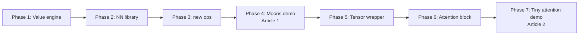

# Nanograd Rebuild and Attention — Learning Plan

A staged hands-on roadmap: rebuild micrograd from scratch in your own package (`nanograd`), extend it with new ops and a tiny Tensor wrapper, then implement single-head attention as the capstone. Each phase produces a visible artifact suitable for an X thread or short article.

## How to use this doc

- Work through phases in order. Each one builds on the previous.
- Tick off the checklist below as you finish each phase.
- Re-implement everything yourself first; only peek at the reference `micrograd/` code when truly stuck.
- When you hit a bug, paste the error + your code into chat — I'll help you unstick.

## Progress checklist

- [ ] **Phase 1** — Rebuild the `Value` engine (`nanograd/engine.py`)
- [ ] **Phase 2** — NN library: `Module`, `Neuron`, `Layer`, `MLP` (`nanograd/nn.py`)
- [ ] **Phase 3** — New ops: `exp`, `log`, `softmax`, `cross_entropy` (`nanograd/ops.py`)
- [ ] **Phase 4** — Moons demo notebook → **Article 1 hero visual**
- [ ] **Phase 5** — Tiny Tensor wrapper (`nanograd/tensor.py`)
- [ ] **Phase 6** — Single-head attention (`nanograd/attention.py`)
- [ ] **Phase 7** — End-to-end attention demo → **Article 2 hero visual**
- [ ] **Articles** — Post X thread 1 after Phase 4, X thread 2 after Phase 7

## Goal

Two shareable artifacts, in order:

1. **Article 1 (mid-roadmap):** "I rebuilt micrograd from scratch and trained a tiny classifier" — visual moons decision boundary.
2. **Article 2 (capstone):** "I built single-head attention from scratch using only my own autograd engine" — visual attention heatmap + tiny demo.

## Project layout

Build inside your forked repo at `/Users/shubhammalhotra/Desktop/andrei/micrograd/` so commits go to your fork (`shubhammalhotra28/micrograd`) and you can link to it from X. Keep your new code in a separate package called `nanograd` so it never clashes with the reference `micrograd/` package.

```
micrograd/                       (your fork)
├── micrograd/                   reference (don't touch — peek when stuck)
├── nanograd/                    YOUR rebuild — package name avoids import clashes
│   ├── __init__.py
│   ├── engine.py                Value class (Phase 1)
│   ├── nn.py                    Neuron / Layer / MLP (Phase 2)
│   ├── ops.py                   new ops: exp, log, softmax, cross_entropy (Phase 3)
│   ├── tensor.py                tiny Tensor wrapper around lists of Value (Phase 5)
│   └── attention.py             single-head attention (Phase 6)
├── notebooks/
│   ├── 01_engine.ipynb
│   ├── 02_nn_xor.ipynb
│   ├── 03_moons_demo.ipynb       Article 1 visuals
│   ├── 04_tensor.ipynb
│   ├── 05_attention.ipynb        Article 2 visuals
│   └── 06_attention_demo.ipynb
└── tests/
    └── test_grads.py             gradient-check vs PyTorch
```

## Phase flow



---

## Phase 1 — Rebuild the `Value` engine from scratch (~2-3 hrs)

File: `nanograd/engine.py`. Re-implement everything by yourself first, only peek at the reference `micrograd/engine.py` when truly stuck.

You must implement:

- `__init__(data, _children=(), _op='')` storing `data`, `grad=0`, `_prev`, `_op`, `_backward = lambda: None`.
- Forward + local backward for: `__add__`, `__mul__`, `__pow__`, `tanh()` (good to write yourself; re-derive `1 - tanh^2`), `relu()`.
- Right-side dunders so `2 * v` works: `__radd__`, `__rmul__`, `__neg__`, `__sub__`, `__truediv__`.
- Type-promotion guard at the top of every binary op (this fixes the bug you already hit):

```python
other = other if isinstance(other, Value) else Value(other)
```

- `backward()` with topological sort then reverse-walk calling each node's `_backward`.

**End-of-phase test** in `notebooks/01_engine.ipynb`:

- Pick the contrived expression from `README.md` (`g = ...`) — confirm `g.data ≈ 24.7041`, `a.grad ≈ 138.83`, `b.grad ≈ 645.58`. If it matches, your engine is correct.

---

## Phase 2 — NN library (~1-2 hrs)

File: `nanograd/nn.py`. Implement `Module` (with `zero_grad`, `parameters`), `Neuron`, `Layer`, `MLP`.

- Matches the structure of the reference `micrograd/nn.py`.
- **End-of-phase test** in `notebooks/02_nn_xor.ipynb`: train a 2-2-1 MLP on XOR until loss < 0.01. Plot loss curve.

---

## Phase 3 — New ops (~1-2 hrs)

File: `nanograd/ops.py`. Add to `Value` (or as standalone functions taking `Value`s):

- `exp()`: `out = e^x`, backward `self.grad += out.data * out.grad`
- `log()`: `out = ln(x)`, backward `self.grad += (1/x) * out.grad`
- `softmax(values)`: takes a list of `Value`s, returns a list of `Value`s summing to 1. Implementation tip: use the numerically stable form (subtract max) once you confirm correctness.
- `cross_entropy(logits, target_idx)`: `softmax` + `-log(p[target_idx])`. Implement directly, NOT as `softmax` followed by `log` separately at first — fewer numerical issues.

**Verify** in `tests/test_grads.py` against PyTorch:

```python
import torch
xt = torch.tensor([1.0, 2.0, 3.0], requires_grad=True)
loss = torch.nn.functional.cross_entropy(xt.unsqueeze(0), torch.tensor([1]))
loss.backward()
# compare xt.grad against your nanograd output
```

---

## Phase 4 — Moons demo (Article 1) (~1-2 hrs)

Notebook: `notebooks/03_moons_demo.ipynb`.

- `sklearn.datasets.make_moons(n_samples=200, noise=0.1)`.
- 2-16-16-2 MLP, cross-entropy loss, SGD with `lr=0.05`, ~100 epochs.
- Plot: data points + decision boundary (mesh-grid + `plt.contourf`). Same vibe as `moon_mlp.png` in the original repo.
- Save the decision-boundary plot — this is your hero image for X thread #1.

---

## Phase 5 — Tiny Tensor wrapper (~3-4 hrs, the real work)

File: `nanograd/tensor.py`. A `Tensor` class that wraps a list-of-list of `Value` objects with shape `(rows, cols)`. Keep it 2D-only — no broadcasting, no batches yet. Just enough to do attention.

Minimum API:

- `Tensor(data)` where `data` is a 2D list of floats (auto-wraps in `Value`s) or a 2D list of `Value`s.
- `.shape`, `.T` (transpose), `__matmul__` (matrix multiply two Tensors), `__add__`, `softmax(axis=-1)` (per-row softmax).
- `parameters()` returning the flat list of underlying `Value`s for the optimizer.

**Key implementation note:** `Tensor.__matmul__` is just nested loops over `Value`s. Each output cell is a `sum` of `Value` products — autograd flows through the `Value` graph automatically, you don't write any new backward code. This is the punchline of the whole project.

**Sanity check** in `notebooks/04_tensor.ipynb`: random 4x3 @ 3x5, compare numerical values vs `numpy`, then call `.backward()` on a sum and verify against PyTorch.

---

## Phase 6 — Single-head attention (~2-3 hrs)

File: `nanograd/attention.py`.

```python
class SelfAttentionHead:
    def __init__(self, n_embed, head_size):
        self.W_q = Tensor.randn(n_embed, head_size)
        self.W_k = Tensor.randn(n_embed, head_size)
        self.W_v = Tensor.randn(n_embed, head_size)

    def __call__(self, X):
        # X shape: (T, n_embed) -- T tokens, each with n_embed dims
        Q = X @ self.W_q                       # (T, head_size)
        K = X @ self.W_k                       # (T, head_size)
        V = X @ self.W_v                       # (T, head_size)
        scores = (Q @ K.T) / sqrt(head_size)   # (T, T)
        weights = scores.softmax(axis=-1)      # (T, T)
        return weights @ V                     # (T, head_size); also return weights for viz
```

**Scope cuts to keep it minimal:**

- Single head only (no multi-head concatenation).
- No causal mask, no positional encoding, no dropout.
- No batch dimension — input is just `(T, n_embed)`.

**Verify** in `notebooks/05_attention.ipynb`: random input, forward pass, plot the `(T, T)` attention weight matrix as a heatmap, confirm rows sum to ~1.0.

---

## Phase 7 — Tiny end-to-end demo (Article 2) (~2-3 hrs)

Notebook: `notebooks/06_attention_demo.ipynb`. Pick whichever of these two you like better:

- **Option A — toy character prediction:** train on a tiny string like `"hello world hello world ..."`. Embed each char, run through one attention head + a linear head, predict next char. Watch loss go down. Visualize attention heatmap on a sample window.
- **Option B — toy classification with attention pooling:** a sequence of 4 tokens, classify whether sequence sum > 0. Lets attention learn to pick out the meaningful token. Easier to debug.

Recommendation: start with **B** (debuggable, faster) and only do A if energy remains.

---

## Article writing tips (after Phase 4 and Phase 7)

- Lead with the visual (decision boundary / attention heatmap) — first tweet must hook.
- Show the smallest, prettiest code snippet that captures the insight (the matmul-just-works moment from Phase 5 is gold).
- Link to the GitHub fork at the end: `https://github.com/shubhammalhotra28/micrograd`.
- Keep each tweet to one idea; aim for 6-10 tweets per thread.

## Total estimated time

~14-20 focused hours. Realistic pace: 2 weekends, or ~1 phase per evening.

---

## Help loop

When stuck, paste these into chat:

1. The phase + file you're working on.
2. The exact error or unexpected output.
3. The code (or relevant snippet).

I'll diagnose and explain the fix. Build the muscle memory yourself — I'm just the spotter.
