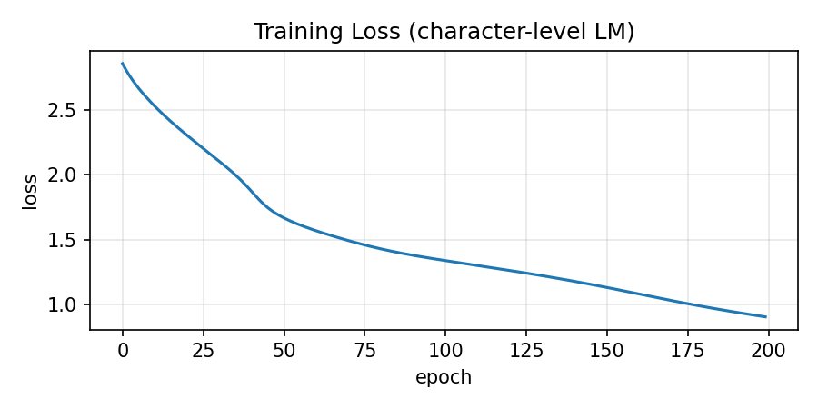
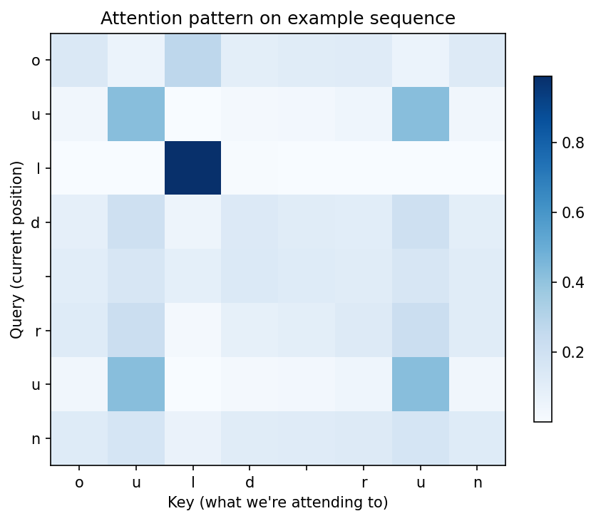

# micrograd (nanograd fork)


A fork of Andrej Karpathy’s micrograd where I extended the tiny autograd engine with a `Tensor` class, implemented single-head self-attention from scratch, and trained a minimal character-level language model — all in pure Python with no NumPy or external frameworks.

### What’s new in this fork

- **`nanograd/engine.py`** — extended `Value` with `exp`, `log`, and other ops needed for attention
- **`nanograd/tensor.py`** — 2D Tensor with matrix multiplication, transpose, and row-wise softmax
- **`nanograd/attention.py`** — `SelfAttentionHead` (the classic 6-line scaled dot-product attention forward pass)
- **`nanograd/ops.py`** — `softmax` and `cross_entropy` implementations
- Full training demo: `notebooks/07_char_lm_demo.ipynb`

A tiny decoder-style model (`TinyCharLM`) combining the attention head with a small MLP was trained on a 109-character repeated corpus. Loss dropped from **2.86 → 0.90** over 200 epochs with clean convergence and no gradient explosions.

### Results

Loss curve:


Attention pattern on an example sequence:


### Quick start – Attention + Char-LM demo

```bash
cd micrograd
# (assuming you have the repo and a Python env with matplotlib)
jupyter notebook notebooks/07_char_lm_demo.ipynb
```

The notebook walks through vocabulary building, dataset creation, the `TinyCharLM` model, training loop, and visualization.

### Original micrograd usage

The original scalar autograd engine and neural net library are still available:

```python
from micrograd.engine import Value

a = Value(-4.0)
b = Value(2.0)
c = a + b
# ... (rest of the original example)
c.backward()
```

See the original `demo.ipynb` for the classic moon-dataset MLP classifier.

### X thread

Full technical thread with code, visuals, and the complete story:  
https://x.com/ShubhamMal72313/status/2053489192232165874

### License

MIT (same as original)
